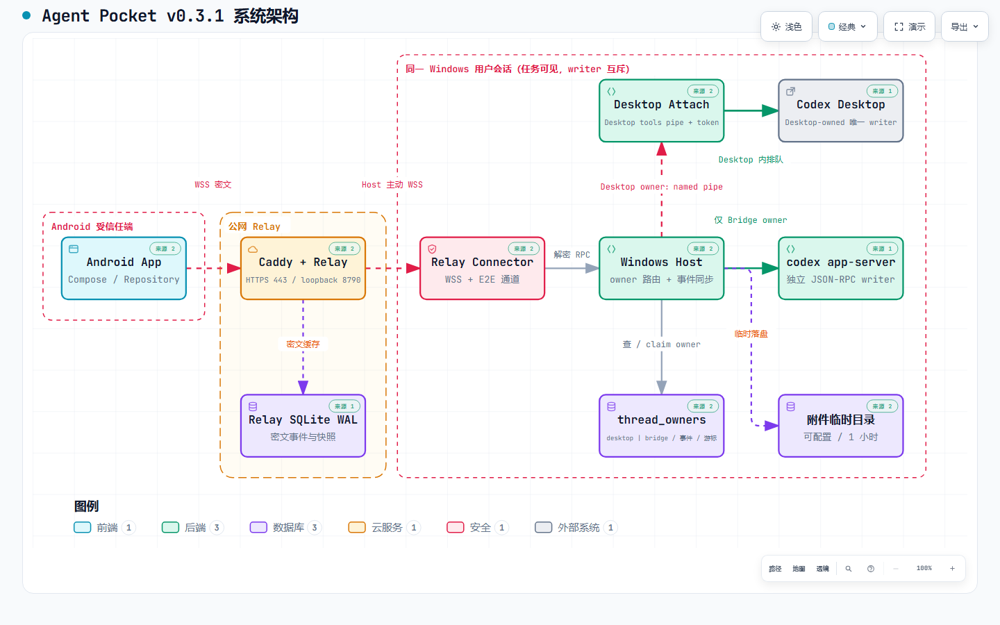
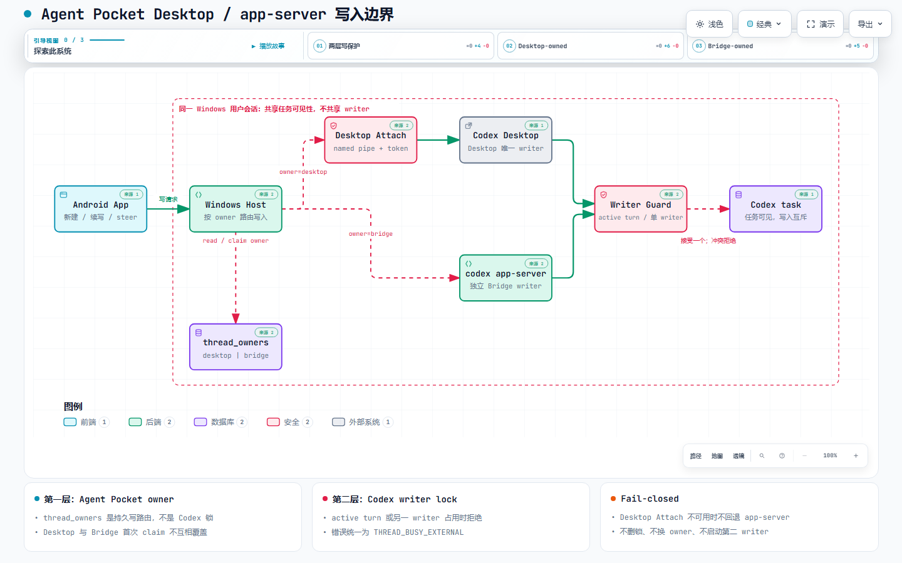

# Agent Pocket

Agent Pocket 是一个 Android 远程 Codex 控制台。Codex Desktop、源码和执行环境留在自己的 Windows 电脑；手机通过自托管 Relay 查看并继续真实 Desktop 任务，不占用 Android 的 VPN 槽位，也不要求手机登录 ChatGPT。

当前 v2 是邀请制、多用户、多主机架构，适合个人、家庭或小团队自托管。项目仍处于实验阶段：Desktop Attach 依赖 Codex Desktop 的内部本地能力，Desktop 更新后可能需要适配。

当前稳定版为 **v0.3.2**。版本由根目录 `VERSION` 统一生成，Android App、Windows Host、Bridge、Relay 与 Desktop Attach 使用同一版本号。

完整的部署、绑定、日常使用、恢复、更新和脱敏说明见 [使用说明](docs/USAGE.md)。

## 给测试用户直接安装

公开仓库只保存脱敏源码和示例配置。可直接安装的 v0.3.2 二进制由管理员从私有发布仓库单独发送：

- `Agent-Pocket-0.3.2-release.apk`：安装到 Android 手机；
- `AgentPocketHost-0.3.2-windows-x64.exe`：安装到每台需要远程控制的 Windows 电脑；
- `Agent-Pocket-0.3.2-bundle.zip`：Android、Windows Host、校验文件和中文说明合集。

管理员先在 Relay 后台创建普通用户，并把用户名和初始密码私下发给用户。私有构建会预填管理员指定的 Relay；主流程是：安装 Windows Host → 配对助手自动打开 → Android 扫描二维码 → 输入账号密码 → Relay 原子激活首台手机 → 自动绑定电脑 → 进入任务列表。无需邀请链接，也无需二次扫码。

安装器不要求管理员权限。当前未购买 Authenticode 证书，Windows 首次安装可能显示 SmartScreen 提示，请同时核对私有发布包中的 `.sha256` 或 `SHA256SUMS.txt`。

第一次给朋友安装时，建议直接按 [中文快速安装说明](docs/FRIEND-QUICKSTART-zh-CN.md) 操作。

## 能力

- 一个 Relay 账号可绑定多台 Windows Host 和多部 Android 手机。
- 首页聚合全部电脑的 Codex 任务，也可按电脑筛选在线状态和任务。
- 读取历史、创建任务、续写原任务、实时同步回复（Markdown 渲染）和查看原生 diff；收件箱按项目分组并支持未读角标。
- 新建任务默认走 Bridge 模式（Host 的 codex app-server 执行）：兼容 cc-switch 等第三方模型通道，支持从手机审批、回答提问、中断，可选原生 Plan 模式（先规划不动文件）、持久任务目标，以及端到端加密的图片/小文件附件；任务同样出现在 Codex Desktop 列表中。也可选择创建真实 Desktop 任务（需要官方模型通道），并通过 Host 临时文件路径附加图片或小文件。
- 首页显示 Host 与 Codex Desktop 的真实运行状态；Desktop 未启动时可从手机请求 Windows Host 唤起固定的 Codex Desktop 应用。
- 预创建账号的首台手机会在正确密码验证后自动批准；已激活账号的新手机仍需要可信手机批准。Host 使用五分钟二维码绑定。
- 任务正文、提示词、代码和命令使用端到端加密，Relay 只保存路由元数据和密文。
- Android 和 Windows Host 都支持签名更新；Host 有活动任务时不会强制替换。

Desktop 原生任务的硬中断、原生审批响应和结构化问题回答目前没有稳定插件接口。Agent Pocket 不会启动第二个 writer、删除锁或模拟坐标点击来强抢任务。

Android v0.3 的界面方向和附件交互见 [视觉原型](docs/prototypes/agent-pocket-v03-overview.png)。Codex 已接入；Grok 与 Kimi Code 目前只展示能力边界，不会伪装成可用状态。

## 架构

下面的图由 [Archify](https://github.com/tt-a1i/archify) 根据实际代码证据生成。PNG 可直接预览；交互版 HTML 下载后用本地浏览器打开，支持搜索、缩放、主题切换和源码证据入口。v0.3.2 新增的账号激活和私有更新链见下文部署说明。

[](docs/diagrams/agent-pocket-system.architecture.html)

### Desktop、app-server 与 writer lock

Codex Desktop 与 Host 启动的 `codex app-server --stdio` 是两个独立的 task host / writer。它们的任务可以出现在同一份 Codex Desktop 列表里，但不能同时写同一个 thread：

| 任务 owner | 唯一 writer | 手机写入路径 | 能力边界 |
|---|---|---|---|
| `desktop` | Codex Desktop | Host → Desktop Attach → Desktop 自己的 task tools / queue | 可续写和等待；硬中断、审批与结构化问题仍回 Desktop 处理 |
| `bridge` | 独立 `codex app-server` | Host → JSON-RPC stdio | 支持续写、steer、中断、审批、问题与 Plan；任务虽可在 Desktop 查看，但不要从 Desktop 续写 |

写保护分两层，不能混为一谈：

1. Host SQLite 的 `thread_owners(thread_id, owner)` 是 Agent Pocket 的持久路由守卫，不是 Codex 锁。首次认领为 `desktop` 或 `bridge` 后，所有手机写请求都只进入对应路径，不自动换 owner。
2. Codex 的 active turn / writer lock 是运行时互斥。任务正由另一个 writer 执行时，Host 返回 `THREAD_BUSY_EXTERNAL`；Desktop Attach 未就绪或检测到 `not-desktop-host` 时也 fail-closed。

Desktop Attach 插件对用户暴露的三个 MCP 工具仍是只读工具；Host 的远程写入走另一条带随机 token 的本地 named pipe，再委托给 Desktop 自己的任务工具。任何失败都不会删除锁、启动第二个 writer，或把 Desktop-owned 任务回退给 app-server。

[](docs/diagrams/agent-pocket-writer-ownership.architecture.html)

[交互版](docs/diagrams/agent-pocket-writer-ownership.architecture.html) · [PNG 预览](docs/diagrams/agent-pocket-writer-ownership.architecture.visual-check.1440x900.light.png) · [JSON 源规范](docs/diagrams/agent-pocket-writer-ownership.architecture.json)

更多图：

- [新建、续写与 writer 冲突时序（交互版）](docs/diagrams/agent-pocket-task-roundtrip.sequence.html) · [PNG 预览](docs/diagrams/agent-pocket-task-roundtrip.sequence.visual-check.1440x900.light.png) · [JSON 源规范](docs/diagrams/agent-pocket-task-roundtrip.sequence.json)
- [附件端到端数据流（交互版）](docs/diagrams/agent-pocket-attachments.dataflow.html) · [PNG 预览](docs/diagrams/agent-pocket-attachments.dataflow.visual-check.1440x900.light.png) · [JSON 源规范](docs/diagrams/agent-pocket-attachments.dataflow.json)
- [同步与失败恢复生命周期（交互版）](docs/diagrams/agent-pocket-sync-recovery.lifecycle.html) · [PNG 预览](docs/diagrams/agent-pocket-sync-recovery.lifecycle.visual-check.1440x900.light.png) · [JSON 源规范](docs/diagrams/agent-pocket-sync-recovery.lifecycle.json)
- [图表索引、生成方法与校验收据](docs/diagrams/README.md)

旧的 [v0.2.9 架构与信息流](docs/ARCHITECTURE-v0.2.9.md) 保留作历史基线，其中部分默认路径、同步策略和版本状态已经被 v0.3.2 取代。

Relay 只监听 `127.0.0.1:8790`，由独立子域名的 Caddy 站点暴露。Windows Host 主动连接 Relay，不需要 SSH 反向隧道、Windows 入站端口或公网防火墙规则。

## 加密与身份

- 用户名不区分大小写；密码使用独立 salt 的 scrypt 摘要。
- 访问令牌 15 分钟、刷新令牌 30 天；数据库只保存令牌哈希，设备、Host 和刷新令牌可独立撤销。
- 账户拥有 Ed25519 签名身份和 X25519 加密身份；每台设备和 Host 另有独立密钥。
- 手机与 Host 通过双方签名的临时 X25519 通道通信；外层信封作为 AEAD associated data，严格 counter 拒绝重放和乱序注入。
- Windows Host 私钥、Host token 和内容密钥使用当前 Windows 用户的 DPAPI 加密落盘；通道握手 ID 会持久化以阻止 Relay 在有效期内跨重启重放。
- Host 事件与快照使用持久 outbox；确认丢失时重发完全相同的密文，Relay 只对完全相同的重复信封返回幂等成功。
- Relay 最多保留每台 Host 最近 24 小时或 20,000 条密文事件和最新密文任务快照；完整历史和所有写操作仍要求 Host 在线。
- FCM 只包含 `hostId/eventId/type`，通知打开后再从 Relay 拉取并解密内容。

这是“管理员托管的端到端加密”，不是绝对零知识。首次管理员初始化时，浏览器生成离线恢复私钥；Relay 只保存恢复公钥和密封数据。持有恢复私钥及口令的管理员可以显式恢复设备，并最终获得读取该用户数据的能力。每次恢复都会写入审计记录。

## 组件与技术

| 组件 | 版本 | 技术 |
|---|---:|---|
| Android | 0.3.2 | Kotlin、Jetpack Compose Material 3、OkHttp、kotlinx.serialization、CameraX/ML Kit、Firebase Messaging、libsodium |
| Windows Host / Bridge | 0.3.2 | Node.js 24、TypeScript、`ws`、Node 内置 SQLite、libsodium、PowerShell、Task Scheduler、Inno Setup |
| Desktop Attach | 0.3.2 | Codex 插件、Windows named pipe、随机本地令牌、Codex Desktop 任务工具 |
| Relay | 0.3.2 | Node.js 24、TypeScript、`ws`、Node 内置 SQLite WAL、firebase-admin、libsodium |
| 管理后台 | 0.3.2 | React、TypeScript、Vite、Lucide；HttpOnly/Secure/SameSite=Strict Cookie 与 CSRF |

Android 要求 Android 8.0 或更高版本，`minSdk 26`、`compileSdk/targetSdk 36`。Windows Host 是每 Windows 用户安装；同一电脑的不同 Windows 用户会显示为不同 Host。

## 快速开始

### 1. Relay

```bash
cd relay
npm ci
npm test
npm run build
```

生产配置和 systemd/Caddy 步骤见 [Relay 部署说明](relay/deploy/README.md)。Relay 必须放在独立 HTTPS 子域名后，loopback 端口不得开放公网。首次启动后执行：

```bash
node dist/cli.js bootstrap
```

在 15 分钟内打开一次性链接，创建管理员账号，并把浏览器下载的加密恢复文件离线保存。恢复文件和口令不得上传到 Relay 或提交 Git。之后在管理页“创建用户”中填写用户名、显示名和初始密码；账号显示为“等待首次登录”，用户第一次从 Android 登录时才会激活。旧邀请 API 仍兼容，但入口只保留在管理页“高级：兼容旧版邀请”中。

### 2. Windows Host

推荐使用每用户 Inno Setup 安装器。首次安装确认 Relay HTTPS 地址、项目白名单和附件临时目录，完成后“Agent Pocket 配对助手”会自动打开并展示五分钟二维码。Android 可在未登录状态先扫码，Relay 地址会自动填入；输入管理员发放的用户名和密码后，首台手机激活和 Host 绑定会连续完成。二维码过期可在助手中刷新，开始菜单也可随时重新打开助手。

附件目录可以放到空间充足的其他本地磁盘；缺少新配置的旧安装仍回退到 `%LOCALAPPDATA%\AgentPocket\attachments`。Codex Desktop 必须由同一 Windows 用户自行登录。

安装器会注册 Host 登录启动任务和 Desktop Attach 插件。Codex Desktop 新建或恢复任务时，插件的 `SessionStart` Hook 会自动探测并建立 Attach 通道；它仍依赖 Codex Desktop 已打开且由同一 Windows 用户运行，不会绕过 Desktop 的 writer 所有权。

源码开发：

```powershell
cd bridge
npm ci
npm test
npm run relay-enroll -- https://relay.example.com
npm start
```

安装器构建、Ed25519 发布签名和覆盖升级说明见 [Windows Host 安装说明](installer/windows/README.md)。安装器不修改系统代理、Windows 防火墙或其他代理服务。

### 3. Android

```powershell
cd android
.\gradlew.bat --no-daemon --no-configuration-cache :app:testDebugUnitTest :app:assembleDebug :app:assembleDebugAndroidTest
```

正式 APK 使用仓库外 keystore 构建。手机只登录 Relay 账号；模型请求仍由 Windows 上已登录的 Codex 发起。

给固定 Relay 的测试用户分发时，可以在私有构建阶段预填 HTTPS 地址，而不把真实地址写进公开源码：

```powershell
.\android\scripts\build-release.ps1 -DefaultRelayUrl https://relay.example.com
```

已有用户保存在 Android Keystore/加密偏好中的 Relay 地址优先，不会被构建默认值覆盖。新版普通界面不再显示邀请注册；旧邀请深链仍保留兼容。

Windows Host 安装器同样支持通过 `-DefaultRelayUrl` 或 `AGENT_POCKET_DEFAULT_RELAY_URL` 注入可编辑初始值；覆盖升级不会重写现有 `host-config.json`。

## 私有发布与鉴权更新

`scripts/publish-private-release.ps1` 从当前公开源码提交构建 Android 和 Windows 成品，要求显式提供私有 Relay 地址与离线 Ed25519 私钥。脚本生成双平台签名 manifest、SHA-256、安装包、中文说明和 bundle；`-Publish` 模式只接受私有 GitHub 仓库，并在固定 SSH Ed25519 指纹校验通过后把更新资产上传到 Relay 白名单目录并注册。

Android 只用 approved device token，Host 只用 Host token 访问 `/api/updates/{platform}/latest` 和对应资产。Relay 不提供匿名下载；manifest、版本、大小、SHA-256、签名和服务器相对路径均需匹配数据库白名单。0.3.2 本身需要手工发送安装，从 0.3.2 开始由 Relay 提供后续自动更新。

## v0.3.2 更新与验证

这一版集中修复了近期手机实测中最影响使用的几条路径：

- 同步失败过的任务会进入待刷新队列，Host 恢复后自动重新读取；
- 选择模型后可以正常创建 Bridge 任务和 Plan 任务；
- Android 任务列表过滤已归档任务；
- 任务详情改为分页读取并与实时事件合并，避免旧结果覆盖新消息；
- Host 同步使用 single-flight 合并重复触发，较重 JSON 解析移出主线程，减少同步卡顿；
- Desktop Attach 随 Host 安装并在 Codex Desktop 任务启动或恢复时自动探测；
- Windows Host 支持独立附件临时目录，Android 与 Host 构建都支持预填可编辑 Relay 地址。
- Relay schema v2 新增预创建账号、持久登录限流和私有更新登记；首次激活、密码修改/重置和会话撤销均有服务端测试。
- Windows 安装后自动打开配对助手；Android 可以先扫码再激活账号并自动续接 Host 绑定。
- Android 与 Host 的后续更新改为 Relay 鉴权下载和 Ed25519 签名 manifest；Host 有活动任务时延后，安装失败恢复已校验备份。

当前源码验证结果：Android JVM 31/31、Bridge 67/67、Relay 26/26；正式发布仍需在持有离线签名材料的构建机上完成 Release/R8/APK 签名和真机端到端验收。Windows 下如仓库路径含中文且 Gradle test worker 报全量 `ClassNotFoundException`，可从临时 ASCII 盘符映射运行测试；这是 Gradle 8.14.3 argfile 路径问题，不是测试类缺失。

## v1 迁移

1. 备份旧 Bridge 数据和 Relay/Caddy 配置。
2. 部署新的 Relay 子域名和 `127.0.0.1:8790` 服务，不改已有代理站点。
3. 每台 Windows 安装 Host v2 并扫码绑定，验证任务列表、Desktop Attach 和实时事件。
4. 安装 Android v2 并登录 Relay；v2 不读取旧直连凭据。
5. 全部 Host 验证后，再停用旧 SSH Tunnel、撤销旧 Bridge 设备令牌并移除旧 Caddy 路由。

不要删除本地 Bridge DB 或 Codex 历史。v1 与 v2 的手机凭据不兼容，这是一次明确切换。

## 安全边界

- Relay 与 Bridge 只监听 loopback；Host 只主动出站连接。
- 所有数据库查询必须带 `account_id`，Host 归单一用户独占。
- 所有 `cwd` 必须是白名单内已存在的绝对真实路径。
- 手机审批不提供永久允许；Desktop owner 与 writer lock 不可绕过。
- Host 更新必须同时通过固定 Ed25519 公钥、签名声明、文件大小和 SHA-256 校验。
- 任何完整 Relay 凭据、令牌、私钥、恢复文件、Firebase 配置、签名材料、任务正文和运维交接都不得提交。

公开部署前请阅读 [SECURITY.md](SECURITY.md)。

## 项目结构

```text
android/                 Android 原生客户端
bridge/                  Windows Bridge 与 Relay Connector
desktop-attach-plugin/   Codex Desktop Attach 实验性插件
installer/windows/       每用户 Host 安装器与签名更新
protocol/                跨端密码固定向量
relay/                   多用户 Relay、管理后台和部署脚本
```

## License

Apache License 2.0。参见 [LICENSE](LICENSE)。

## 友情链接

- [LINUX DO](https://linux.do/)
