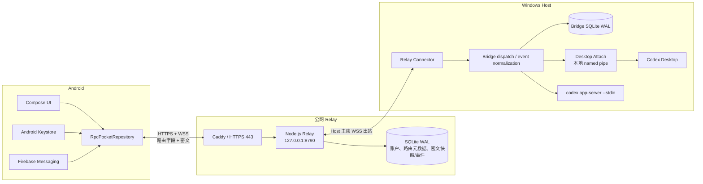
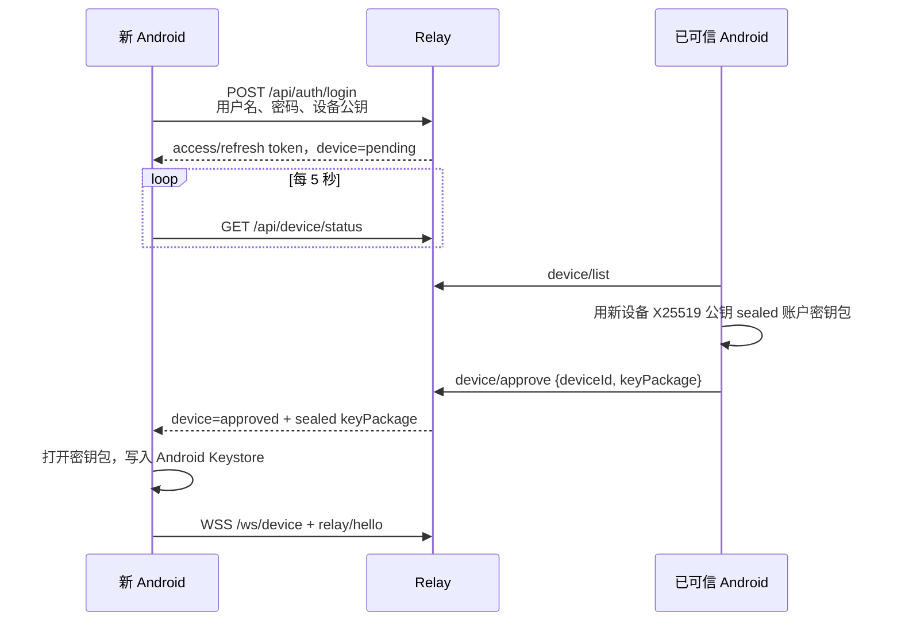
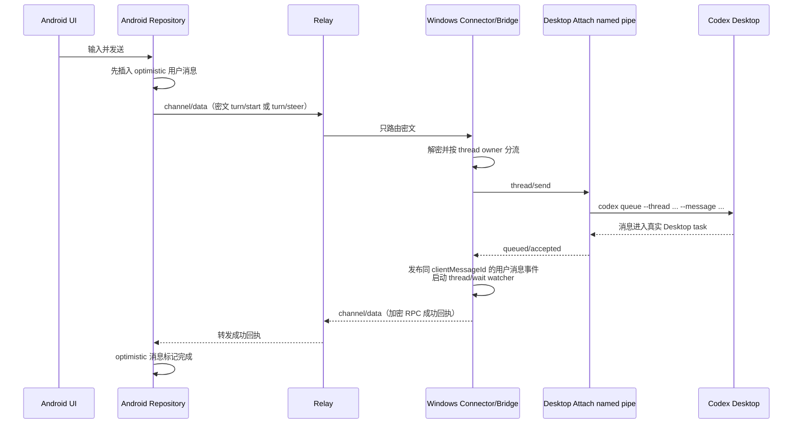

# Agent Pocket v0.2.9 架构与信息流

> 文档基线：Agent Pocket `v0.2.9`，仓库提交 `5599576`，核对日期 2026-09-01。本文描述的是当前代码已经实现的行为，不是最初规划或未来路线图。

> **v0.2.10–v0.2.15 变更附记（2026-09-01）**：本文基线之后的行为变化如下，详情与部署状态见 [HANDOFF.md](../HANDOFF.md)。
> - §5.10 事件重放已重构：Android 事件按 Host 互斥串行应用；无法解密/处理的事件跳过并推进游标（不再卡死后续同步）；检测到 gap 不再清零游标，改为单飞触发整机重同步；`sync.required` 改为防抖后台拉取。
> - 加密通道具备自愈：握手超时或 RPC 超时会丢弃通道并在下次调用重建（§5.4 的"通道永久失效"问题已消除）。
> - §5.6 手机新建任务默认 `target=bridge`（新任务页可选 Desktop）；原因：第三方 HTTP 模型通道上 Desktop 引擎的有状态首轮间歇性失败（§9.6 上游问题的通道版）。Bridge 任务实测会出现在 Desktop 任务列表中（§6 表中"不保证"已被实测推翻），但仍不可在 Desktop 端续写（单 writer）。
> - Desktop 创建核验不再抛错：threadId 存在即返回成功并附警告；插件（0.1.7）在 12 秒窗口内、Bridge watcher 在其后，都会对死亡的首轮自动经 `codex queue` 重投一次提示词。
> - 新增能力：Bridge 任务支持原生 Plan 协作模式（`thread/start` 传 `mode:"plan"`）与持久任务目标（`goal/get|set|clear` RPC）；`item/plan/delta` 归一化为流式助手消息而非 `plan.updated`。
> - Android UI：收件箱按项目分组（可折叠）、真实未读角标、Markdown 渲染、手动刷新与同步进度、空闲状态文案修正。

## 1. 项目目标与当前设计取舍

Agent Pocket 的目标不是在手机上再运行一套 Codex，而是让手机远程查看和继续 Windows 上已有的 Codex 工作：

- 源码、Codex Desktop、账号登录和命令执行都留在 Windows；
- Android 只承担任务列表、消息输入、状态展示、通知和少量控制；
- Windows Host 主动连接公网 Relay，因此不需要手机占用 VPN 槽位，也不需要给 Windows 开入站端口；
- 一个 Relay 账号可以绑定多台 Windows Host 和多部手机；
- Relay 负责鉴权、路由、短期缓存和通知，但正常运行时不读取任务正文；
- Desktop 任务优先继续使用 Codex Desktop 自己的任务，不由独立 app-server 强抢 writer。

当前版本有一个必须先理解的边界：**“真实 Desktop 任务”和“Bridge 自建任务”是两种不同的执行路径，能力并不完全相同。** Android 默认新建的是 Desktop 任务，因为这是项目的主要使用场景；Bridge 自建任务保留完整的 app-server 控制能力，主要作为协议完整路径和兼容能力存在。

## 2. 总体架构



信任边界可以概括为：

- Android 和 Windows Host 持有内容密钥，可以解密任务内容；
- Relay 持有账号、设备、Host 和会话的服务端记录，但任务正文以密文保存；
- Codex Desktop 和独立 app-server 都只在 Windows 本机运行；
- Desktop Attach 只监听 Windows named pipe，不监听 TCP、局域网或公网；
- 管理员持有离线恢复密钥时可以显式恢复账户，因此这是“管理员托管的端到端加密”，不是绝对零知识。

## 3. 代码框架

### 3.1 顶层目录

| 目录 | 职责 |
|---|---|
| `android/` | Android 原生 App：登录、Host 选择、任务 UI、加密通道、事件应用、通知和自动更新 |
| `bridge/` | Windows Host：Bridge RPC、项目白名单、Codex app-server、Desktop Attach 客户端、Relay Connector、本地事件库和 Host 更新 |
| `desktop-attach-plugin/` | Codex Desktop 插件：读取/创建/续写/等待真实 Desktop 任务，并通过本地 named pipe 暴露给 Bridge |
| `relay/` | 多用户 Relay、REST/WS 接口、SQLite、FCM、管理后台、邀请与离线恢复工具 |
| `installer/windows/` | Inno Setup 每用户安装器、任务计划、配置、更新和发布签名脚本 |
| `protocol/` | Android、Windows 和 Relay 之间的密码固定向量与互操作验证材料 |

### 3.2 Android 关键文件

| 文件 | 作用 |
|---|---|
| `RpcPocketRepository.kt` | Android 的核心状态机；维护 Host、项目、模型、任务、通道、事件游标和 UI 状态 |
| `RelayCrypto.kt` | 设备/账户密钥、sealed box、X25519 握手、Ed25519 验签、secretstream 和事件解密 |
| `BridgeRpcClient.kt` | OkHttp WebSocket 外层 JSON-RPC 客户端 |
| `SecurePrefs.kt` | 使用 Android Keystore 的 AES-GCM 密钥加密 Relay 凭据、账户私钥、内容密钥和刷新令牌 |
| `BridgeSyncService.kt` | `dataSync` 前台服务，维持后台实时连接；Android 超时后停止并降级到 FCM |
| `PocketMessagingService.kt` | 接收只含路由信息的 FCM data 消息并生成本地通知 |
| `ui/screens/` | 登录/配对、聚合收件箱、新任务、会话详情、diff 和设置页面 |

Android 内部所有任务以 `(hostId, threadId)` 为主键。编码后的 `ThreadRef` 用一个分隔符连接两者，避免不同电脑出现相同 `threadId` 时互相覆盖。

### 3.3 Windows Host 关键文件

| 文件 | 作用 |
|---|---|
| `bridge/src/server.ts` | Bridge JSON-RPC dispatch、Desktop/Bridge owner 分流、事件归一化和 Desktop watcher |
| `bridge/src/relay-connector.ts` | 主动连接 Relay，建立手机—Host 加密通道，转发 RPC，上传密文事件和任务快照 |
| `bridge/src/relay-crypto.ts` | Host 身份、握手、通道加密、账户事件/快照加密和持久 outbox |
| `bridge/src/desktop-attach.ts` | 读取 Desktop Attach 注册文件，通过带随机令牌的 named pipe 调用插件 |
| `bridge/src/codex.ts` | 启动 `codex app-server --stdio`，完成 `initialize/initialized`，检查版本并转发协议消息 |
| `bridge/src/store.ts` | 本地设备、事件、待审批、线程 owner 和游标；SQLite 使用 WAL |
| `bridge/src/config.ts` | loopback 监听、同一 `CODEX_HOME`、项目白名单和真实路径校验 |

Bridge 本地仍监听 `127.0.0.1:8787`，但 v2 手机不直接访问这个端口。公网路径由 Relay Connector 主动出站建立。

### 3.4 Relay 关键文件

| 文件 | 作用 |
|---|---|
| `relay/src/server.ts` | REST、设备/Host WebSocket、外层协议、通道路由、快照/事件接收和管理接口 |
| `relay/src/store.ts` | 多用户 SQLite 数据模型；所有业务查询带 `account_id`，并执行事件裁剪 |
| `relay/src/auth.ts` | 用户名/密码校验和带独立 salt 的 scrypt 密码摘要 |
| `relay/src/protocol.ts` | 令牌有效期、信封结构、大小上限和错误类型 |
| `relay/src/fcm.ts` | FCM 字段白名单，只发送 `hostId/eventId/type` |
| `relay/src/recovery.ts` | 使用离线恢复文件为待批准设备重新密封账户密钥包 |
| `relay/admin/` | React/Vite 管理后台和浏览器端初始化密钥生成 |

Relay 默认只允许监听 `127.0.0.1:8790` 或 `::1`，由 Caddy 的独立 HTTPS 子域名转发。

## 4. 身份、设备和密钥

### 4.1 账户和会话

- 用户名统一转为不区分大小写的形式；
- 密码长度为 12–128，Relay 使用独立 salt 的 scrypt 摘要保存；
- access token 有效期 15 分钟；
- refresh token 有效期 30 天；
- Relay 数据库只保存 token 哈希；
- 手机、Host 和刷新会话可以独立撤销。

### 4.2 密钥层次

每个账户有：

- Ed25519 账户签名身份；
- X25519 账户加密身份；
- 一把 XChaCha20-Poly1305 内容密钥。

每部手机和每台 Host 还有自己的 Ed25519/X25519 设备身份。账户内容密钥不会以明文交给 Relay：

- 第一个设备注册时，把账户密钥包分别 sealed 给本设备和管理员恢复公钥；
- 新手机登录后先成为 `pending`，已有可信手机将完整账户密钥包 sealed 给新手机；
- Host 绑定时，手机只把内容密钥 sealed 给 Host；
- 全部手机丢失时，管理员本地恢复工具用离线恢复私钥打开托管密文，再 sealed 给新设备。

Android 将设备私钥、账户私钥、内容密钥和令牌整体用 Android Keystore 生成的 AES-GCM 密钥加密保存。Windows Host 的同类敏感材料由当前 Windows 用户的 DPAPI 保护。

## 5. 信息如何传递

### 5.1 两种数据通路

v0.2.9 不是“所有消息都走一条 WebSocket”。它把信息拆为两条通路：

1. **命令通路**：手机向某台在线 Host 发 JSON-RPC，请求创建、读取或续写任务；Host 在同一临时加密通道中返回成功或失败。
2. **事件通路**：Codex 的回复、状态、命令输出和 diff 由 Bridge 归一化成事件，再用账户内容密钥加密后上传 Relay；手机实时接收或断线后重放。

这意味着“发送成功”只代表 Host 接受了操作，不代表完整回复已经随 RPC 返回。真正的回复会稍后通过事件通路到达。

### 5.2 登录和新设备批准



待批准设备也能获得短期登录会话，用于轮询自己的状态，但不能建立正常任务通道。若设备被拒绝、撤销或待批准会话失效，Android 会清除本地凭据并要求重新登录。

### 5.3 Host 绑定

1. Windows Host 本地生成自己的签名和加密密钥；
2. Host 调用 Relay 的 enrollment 接口，得到五分钟有效的 `enrollmentId + secret`；
3. Windows 显示 `agentpocket://relay-host?...` 二维码；
4. 已批准手机扫描后核对 Relay 地址，并读取 Host 公钥；
5. 手机把账户内容密钥 sealed 给 Host 公钥，调用 `host/enroll/approve`；
6. Host 每两秒查询状态，批准后领取 `hostId`、Host token 和密钥包；
7. Host 解开内容密钥，之后主动连接 `/ws/host`。

二维码只用于一次性绑定，不承载长期 Host token 或账户明文密钥。

### 5.4 建立手机—Host 临时加密通道

手机登录 Relay 后先调用 `host/list`。对每台需要通信的在线 Host：

1. 手机生成临时 X25519 密钥和 device→host secretstream header；
2. 握手内容绑定 `accountId/hostId/deviceId/channelId/issuedAt`，由手机设备 Ed25519 私钥签名；
3. 整个握手再 sealed 给 Host X25519 公钥，作为 `channel/open` 信封交给 Relay；
4. Relay 校验登录身份、账号归属、Host 在线状态和 counter，但不解密 payload；
5. Host 解封、验证手机签名和五分钟时间窗，生成自己的临时密钥及 host→device secretstream；
6. Host 把响应 sealed 给手机公钥并签名；
7. 手机验证 Host 签名后，通道进入 ready 状态。

后续 `channel/data` 使用 libsodium secretstream。外层信封字段：

```text
accountId, hostId, deviceId, channelId, counter, kind, ciphertext
```

这些字段同时作为 AEAD associated data。Relay 和两端都要求 counter 严格递增，用来拒绝重放和乱序注入。

### 5.5 启动同步和任务列表

Android 每次成功连接 Relay 后依次执行：

1. `relay/hello`；
2. `host/list`；
3. `device/list`；
4. 对每台 Host 读取 `snapshot/get`；
5. 从该 Host 的本地 `lastSeq` 调用 `event/replay`；
6. 如果 Host 在线，建立临时通道；
7. 经通道调用 `project/list`、`model/list` 和 `thread/list`。

任务列表默认聚合所有 Host，UI 用 `(hostId, threadId)` 区分任务。选择某台 Host 后，项目、模型和任务列表都切换到该 Host 的数据。

快照用于“先快速显示一个近期任务列表”，在线 Host 的 `thread/list` 才是当前权威结果。完整任务正文不会存入 Relay 快照，进入会话时 Android 会向在线 Host 分页调用 `thread/read`，直到拿完 Desktop 返回的全部 cursor 页面。

### 5.6 手机新建 Desktop 任务

Android 当前固定发送：

```json
{
  "method": "thread/start",
  "params": {
    "cwd": "...",
    "text": "...",
    "model": "...",
    "effort": "...",
    "target": "desktop",
    "workspaceMode": "local",
    "clientMessageId": "mobile-..."
  }
}
```

到达 Bridge 后：

1. Bridge 将 `cwd` 解析为真实绝对路径，并检查它位于项目白名单内；
2. Desktop Attach 调用 Desktop 的 `list_projects`，要求该路径已经保存为本地 Codex 项目；
3. Desktop Attach 调用 Desktop 的 `create_thread`；
4. 创建后立即用 `wait_threads` 核验任务是否进入 `systemError` 或 turn 失败；
5. Bridge 将任务 owner 持久记录为 `desktop`，发布用户消息事件，并启动 Desktop watcher；
6. Android 把返回的任务插入当前 Host 列表并读取详情。

如果用户明确创建 `target=bridge` 的任务，则 Bridge 会通过独立 `codex app-server --stdio` 执行 `thread/start` 和 `turn/start`，并把 owner 记录为 `bridge`。

### 5.7 手机续写 Desktop 任务



Android 根据本地是否存在活动 turn 选择内部方法名：无活动 turn 用 `turn/start`，有活动 turn 用 `turn/steer`。但 Bridge 会先查看持久化 owner：只要任务不是 `bridge` owner，两种方法最终都进入 `sendToDesktop`，不会调用独立 app-server，也不会删除 Desktop writer lock。

Desktop Attach 的生产发送路径是：

```text
codex queue --thread <threadId> --message <text>
```

这样写入的是 Desktop 能识别的标准用户消息。旧的 `send_message_to_thread` 路径只在显式设置 `AGENT_POCKET_CODEX_QUEUE_DISABLED=1` 时作为兼容测试路径使用。

### 5.8 Desktop 回复如何回到手机

续写请求的 RPC 成功回执不携带完整回复。回复路径如下：

1. Bridge 为目标 Desktop 任务启动 watcher；
2. watcher 每次调用 Desktop Attach 的 `thread/wait`，单次最多等待 8 秒；
3. Desktop Attach 内部调用 Codex Desktop 的 `wait_threads`；
4. 如果 `wait_threads` 返回最新 assistant message，则直接使用；
5. 如果任务已经结束但返回中没有正文，最多重试四次读取本地 rollout，按 `threadId + turnId` 恢复最终 assistant text；
6. Bridge 把获得的完整文本归一化成 `message.delta`，设置 `replace=true`，同时发布 `sync.required`；
7. Bridge 先把事件写入本地 SQLite，再通知 Relay Connector；
8. Relay Connector 使用账户内容密钥将整个事件加密为 `event.append`，通过持久 outbox 上传；
9. Relay 给该 Host 分配独立递增 `seq`，保存密文并向同账号在线手机广播 `relay/event`；
10. Android 用内容密钥解密事件，按 `(hostId, threadId, itemId)` 更新消息；收到 `sync.required` 时再读取完整线程，修正任何遗漏。

Desktop 回复当前是“完整文本替换”，不是 Desktop 原生逐 token 订阅。Bridge 自建任务则可以直接接收 app-server 的 `item/agentMessage/delta`，Android 会把高频 delta 以 50ms 为窗口合并后再更新 Compose 状态，避免逐 token 重组整个列表。

### 5.9 Bridge 自建任务的事件流

独立 app-server 在 Windows 启动时：

1. 使用同一 `CODEX_HOME` 执行 `codex app-server --stdio`；
2. 先检查 Codex 版本，再发送 `initialize` 和 `initialized`；
3. 版本过低时进入只读状态，不自动升级 Codex；
4. app-server notification 由 Bridge 归一化为统一事件。

主要映射：

| app-server 消息 | Bridge 事件 |
|---|---|
| `item/agentMessage/delta` | `message.delta` |
| `turn/plan/updated`、`item/plan/delta` | `plan.updated` |
| command started/completed/output delta | `command.updated` |
| `turn/diff/updated` | `diff.updated` |
| approval server request | `approval.request` |
| user input server request | `question.request` |
| turn/thread status | `turn.status` |

命令输出累计上限 256KiB，diff 上限 2MiB；超限时事件带截断标志。Bridge 任务的审批响应具有幂等记录，只提供允许一次、拒绝和取消。

### 5.10 断线、重连、快照和事件重放

Android 和 Host 都使用指数退避重连，起始约 1 秒，最高 30 秒。Android 还监听系统默认网络变化，在 Wi-Fi、移动网络或其他网络切换后重新建立连接。

事件可靠性分为两层：

- Bridge 本地 SQLite 保存最多 24 小时或 20,000 条明文归一化事件；
- Relay 按 Host 保存最多 24 小时或 20,000 条账户加密事件。

Host 的事件上传使用持久 outbox：先把“待发送事件 + 完整密文信封”写入 Host 身份文件，再请求 `event/append`。如果 ACK 丢失，Host 重发完全相同的 `eventId/counter/ciphertext`，Relay 将其识别为幂等重复；同一个 `eventId` 若对应不同密文则拒绝。

Android 为每台 Host 单独保存 `lastSeq`：

- `seq <= lastSeq` 的重复事件忽略；
- 正常事件必须等于 `lastSeq + 1`；
- 检测到缺口时清零游标并执行 Host 完整同步；
- 如果 Relay 已裁剪旧事件并返回 `EVENT_GAP`，Android 先保留/重读快照，再从 Relay 当前仍保留的最早事件重新应用；
- Host 在线时最终再以 `thread/list` 和 `thread/read` 校正状态。

### 5.11 FCM 通知

Relay 发送的 FCM data-only 消息只有：

```text
hostId, eventId, type
```

其中 `type` 只分为 `attention`、`completed` 和 `status`。提示词、代码、命令、审批详情和回复正文都不会放入 FCM。

Android 收到后只显示“任务需要关注”或“任务已完成”。用户点击通知时，App 使用 `hostId + eventId` 调用 `event/get`，下载密文、解密出真实 `threadId`，再打开对应 Host 的会话。

## 6. Desktop 任务与 Bridge 任务对比

| 能力 | Desktop 任务 | Bridge 自建任务 |
|---|---:|---:|
| 出现在真实 Codex Desktop 中 | 是 | 不保证，独立 app-server 管理 |
| 手机读取完整历史 | 是，依赖 Desktop `read_thread` 分页 | 是，依赖 app-server `thread/read` |
| 手机续写 | 是，`codex queue` | 是，`turn/start` / `turn/steer` |
| 实时回复 | 轮询/等待后整段替换，rollout 兜底 | app-server 原生 delta |
| 硬中断 | 否 | 是 |
| 手机审批 | 否 | 是，仅允许一次/拒绝/取消 |
| 结构化问题回答 | 否 | 是 |
| 原生 diff/命令事件 | 取决于 Desktop 读取结果，当前不完整 | 是 |
| writer 归属 | Codex Desktop | Bridge app-server |

`thread_owners` 表会持久记录 `desktop | bridge`。一个任务一旦归 Desktop，Bridge 不会因为某次 Desktop 调用失败就改用 app-server 接管，也不会删除锁或启动第二 writer。

## 7. 数据保存边界

| 位置 | 保存内容 | 是否含可读任务正文 |
|---|---|---:|
| Android Keystore + SharedPreferences | 加密后的账户/设备私钥、内容密钥、token、每 Host 游标 | 密钥可解密正文；任务 UI 主体主要在内存 |
| Windows Codex | 完整真实任务、rollout、项目和执行结果 | 是 |
| Bridge SQLite | 设备、归一化近期事件、审批、thread owner | 是，近期事件可能含正文/输出 |
| Host 身份文件 | DPAPI 保护的 Host 私钥、token、内容密钥、outbox/counter | 不直接保存完整历史 |
| Relay SQLite | 账户、设备、Host、会话哈希、密文快照、密文事件、FCM token、审计 | 正常运行时否 |
| FCM | `hostId/eventId/type` | 否 |

Relay 不提供完整离线历史仓库。Host 离线时，手机只能看到最近一次密文任务列表快照和近期已缓存事件；进入完整会话、发送任何写操作都要求 Host 在线。

## 8. 安全边界

- Relay 和 Bridge 默认仅监听 loopback；Windows Host 只做 WSS 出站连接；
- Relay 的账号数据访问以 `account_id` 为边界，Host 归单一账号；
- 每个 `cwd` 都要经过真实路径解析和项目白名单校验；
- 临时通道握手双方签名、绑定身份和五分钟时间窗；
- secretstream counter 和 Relay 路由 counter 同时拒绝重放/乱序；
- 事件和快照的外层路由字段加入 AEAD associated data，篡改会导致解密失败；
- Desktop Attach named pipe 使用随机 32 字节令牌，并继承当前 Windows 用户配置目录的访问控制；
- FCM 和 Relay 日志不应记录任务正文；
- 管理员恢复必须持有离线恢复文件、恢复口令和管理员凭据，并写入审计日志；
- Windows/Android 更新同时校验 SHA-256 和 Ed25519 发布签名，发布私钥不在仓库中。

## 9. 当前版本不足

### 9.1 Desktop Attach 不是稳定的官方兼容层

Desktop Attach 依赖 Codex Desktop 提供的内部环境变量 `CODEX_APP_TOOLS_PIPE_PATH` 和任务工具。这些不是长期公共兼容承诺。Desktop 更新后，named pipe、工具输入输出或任务状态结构发生变化，都可能要求插件适配。

### 9.2 Desktop 控制能力不完整

当前无法通过稳定接口对 Desktop 原生任务执行：

- 硬中断；
- 原生审批响应；
- 结构化问题回答；
- 与 app-server 同等完整的命令、计划和 diff 增量订阅。

因此 Android 虽然有中断、审批和问题 UI，但这些完整能力主要只适用于 Bridge 自建任务。Desktop 任务会明确返回不支持，不会偷偷换 writer。

### 9.3 Desktop 回复不是原生事件订阅

Desktop 回复依赖 `wait_threads`、cursor 和本地 rollout 兜底：

- 不能保证像 app-server 那样逐 token 到达；
- 常见表现是等待一段时间后整段替换；
- Desktop 状态变化但正文尚未落盘时，可能要靠后续 `sync.required + thread/read` 补齐；
- watcher 或插件通道中断时只能要求完整同步，不能恢复 Desktop 内部的每个中间事件。

### 9.4 密文任务快照更新不够及时

当前 `RelayConnector.sendSnapshot()` 只在 Host 成功连接 Relay 时执行，没有在每次任务列表变化后立即刷新。因此 Host 长时间保持在线时，Relay 上的“最新任务列表快照”可能落后于实际 Desktop 列表。在线手机会再调用 `thread/list` 得到正确结果，但 Host 离线后的快速列表可能是旧的。

### 9.5 完整功能强依赖 Windows 在线状态

完整操作要求同时满足：

- Windows 用户会话已登录；
- Host 任务正在运行并连上 Relay；
- Codex Desktop 已登录；
- Desktop Attach 已在某个 Desktop 任务中加载并建立本地 host；
- 项目已保存到 Codex Desktop，且路径位于 Host 白名单中。

其中任一环节退出，任务列表、创建或续写都可能暂时不可用。

### 9.6 当前 Codex Desktop 存在已知新建任务上游回归

截至本文核对环境，Codex Desktop `26.825.6671.0`（内置 CLI `0.151.0-alpha.7.2`）的官方 `create_thread` 路径可能先返回 thread ID，随后因 `function_call_output requires call_id on HTTP requests` 进入 `systemError`。该问题绕过 Android、Relay 和 Agent Pocket 直接调用 Desktop 能力也能复现。

v0.2.9 已增加创建后的状态核验，避免手机误报“创建成功”，但真正恢复手机新建 Desktop 任务仍依赖上游修复或兼容实现。

### 9.7 Relay 只保存有限离线数据

Relay 每台 Host 只保留最新任务列表快照和最多 24 小时或 20,000 条密文事件：

- 不能离线浏览完整历史；
- 事件超过窗口后只能靠快照和在线 Host 重新同步；
- Relay 丢失不会删除 Windows 上的 Codex 历史，但会丢失账号、绑定关系、近期事件和审计数据，必须依赖备份恢复。

### 9.8 Android 后台连接受系统限制

Android 15 对 `dataSync` 前台服务有六小时限制。到期后 App 会停止长连接并依赖 FCM；重新打开 App 才恢复实时 WebSocket。若用户禁止通知、系统限制后台或设备无法访问 FCM，后台提醒会退化。

### 9.9 管理员托管恢复不等于零知识

持有离线恢复私钥、恢复口令和管理员权限的人，可以主动恢复一个新设备并最终读取用户内容。设计通过离线保存和审计降低风险，但无法把管理员排除在信任模型之外。

### 9.10 单节点和发布成熟度

- Relay 是单节点 SQLite WAL，没有多节点一致性、自动故障转移或跨区容灾；
- 100 用户/500 Host 是目标验收规模，不代表公共 SaaS 承诺；
- Windows 安装器未购买 Authenticode 证书，首次安装可能触发 SmartScreen；
- 自动更新依赖 GitHub Releases 和发布签名端点可访问；
- Android、Host、Relay 和 Desktop 插件的内部版本号尚未完全统一，排障时要同时记录 Release 版本和各组件版本；
- 项目仍是实验性自托管工具，不应按生产级公共服务宣传。

## 10. 后续优先级建议

按对现有体验的实际收益排序：

1. 在任务列表、Desktop watcher 终态和任务创建后刷新并上传密文快照，解决离线列表陈旧；
2. 为 Desktop Attach 建立明确的 Codex Desktop 兼容矩阵和自动探测，升级后先只读验证再开放写操作；
3. 在 Desktop 能力允许时接入正式的 turn 事件/中断/审批接口，减少 `wait_threads + rollout` 补偿；
4. 增加 Relay 数据库自动备份、恢复演练和管理员审计导出；
5. 完善多 Host、手机换网、长期后台、事件裁剪和 Desktop 升级后的真实设备 E2E；
6. 只有在单节点成为实际瓶颈后，再考虑 PostgreSQL、队列或多节点 Relay。

最后一条是当前架构最重要的维护原则：**不要为了让手机“看起来能控制”而绕过 Desktop owner、删除锁或启动第二 writer。状态晚一点可以补同步，任务被两个执行器同时写坏则无法可靠恢复。**
